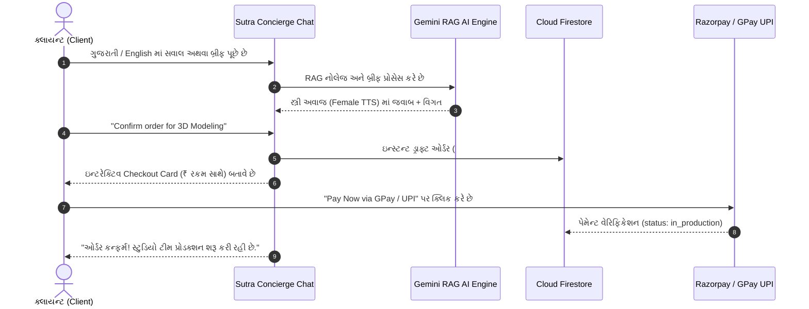

# SUTRA STUDIO — Comprehensive System Documentation & Production Roadmap
*સૂત્ર સ્ટુડિયો — સંપૂર્ણ સિસ્ટમ સ્ટેટસ, સેવાઓ, પેમેન્ટ (GPay) અને મોબાઇલ APK રોડમેપ*

---

## 1. Current Feature Status Matrix (કઈ વસ્તુ ચાલે છે અને શું સ્ટેટસ છે)

| મોડ્યુલ / સુવિધા | વર્તમાન સ્ટેટસ | ફ્રી / પેઇડ મોડેલ | વિગત |
| :--- | :--- | :--- | :--- |
| **Authentication (લૉગિન / સાઇનઅપ)** | ✅ **100% ચાલુ** | **100% Free** (Firebase Auth) | Email/Password, Admin & Client Roles, Session Cookies, Auto-Redirect. |
| **AI Concierge Chat (ચેટબૉક્સ)** | ✅ **100% ચાલુ** | **100% Free** (Gemini 2.5 Flash Free Tier) | ગુજરાતી, હિન્દી અને અંગ્રેજી ઓટો-ડિટેક્ટ, RAG નોલેજ બેઝ, સ્ત્રી અવાજ (Female Voice TTS), માઇક સ્પીચ ઇનપુટ. |
| **3D Particle Wings Canvas** | ✅ **100% ચાલુ** | **100% Free** (HTML5 60FPS WebGL) | Aeterna જેવું ઇન્ટરેક્ટિવ 3D ગોલ્ડન પાર્ટીકલ એનિમેશન (/studio પેજ પર). |
| **Brand Prompts Pack** | ✅ **100% ચાલુ** | **100% Free** (Internal Generator) | 12 સિસ્ટમ પ્રોમ્પ્ટ બિલ્ડર્સ, Meta Ads બ્લૂપ્રિન્ટ્સ, Kling 4K વિડિઓ પ્રોમ્પ્ટ્સ. |
| **Client Portal (/dashboard)** | ✅ **100% ચાલુ** | **100% Free** | પ્રોજેક્ટ માઇલસ્ટોન્સ, ઓર્ડર ટ્રેકિંગ, ઇન્વૉઇસિસ, પ્રોફાઇલ સેટિંગ્સ. |
| **Admin Hub (/admin)** | ✅ **100% ચાલુ** | **100% Free** | ક્લાયન્ટ ડિરેક્ટરી, ઇન્ટિગ્રેશન ગાર્ડ, બ્રાન્ડ પ્રોમ્પ્ટ્સ, સિસ્ટમ ઓડિટ. |
| **Cloud Database (Firestore)** | ✅ **100% ચાલુ** | **100% Free Tier** (Spark Plan) | રિયલ-ટાઇમ યુઝર્સ, ઓર્ડર્સ, ચેટ હિસ્ટ્રી, ઇન્ક્વાયરીઝ ડેટા સ્ટોરેજ. |
| **Media Vault (Google Drive)** | ✅ **100% ચાલુ** | **100% Free** (15GB Google Drive) | 4K વિડિઓ, 3D GLTF મોડલ્સ, દસ્તાવેજો માટે ક્લાઉડ સંગ્રહ. |
| **Payment Gateway (Razorpay)** | 🟡 **સેટઅપ રેડી (Sandbox & Live)** | **ફ્રી ટેસ્ટિંગ / 2% પર-ટ્રાન્ઝેક્શન લાઈવ** | GPay, PhonePe, UPI QR, કાર્ડ્સ, નેટ બેંકિંગ સપોર્ટ. |

---

## 2. 12 Creative Capabilities & Services (કઈ સર્વિસ કેવી રીતે કામ કરે છે)

| # | સર્વિસનું નામ | ક્ષમતા અને આઉટપુટ | ઓટોમેશન વર્કફ્લો |
| :---: | :--- | :--- | :--- |
| **1** | **Image Creation** | 8K આર્કિટેક્ચરલ, પ્રોડક્ટ અને લક્ઝરી બ્રાન્ડિંગ રેન્ડર્સ | Gemini / Midjourney / Flux પ્રોમ્પ્ટ એન્જિન |
| **2** | **Video Creation** | 4K સિનેમેટિક વિડિઓઝ, રીલ્સ અને મોશન ગ્રાફિક્સ | Kling 4K + Runway Gen-3 પાઇપલાઇન |
| **3** | **3D Modeling** | ટેક્ષ્ચર્ડ GLTF/GLB મોડલ્સ અને PBR મટિરિયલ્સ | 3D સ્પેસિફિકેશન કન્વર્ટર |
| **4** | **360° Virtual Tours** | ઇક્વિરેક્ટેન્ગ્યુલર VR પ્રોજેક્શન અને ઇન્ટરેક્ટિવ સ્પેશિયલ ટૂર્સ | વેબ VR એન્જિન |
| **5** | **Interior Design** | સ્પેસ પ્લાનિંગ, લાઇટિંગ સ્ટડીઝ અને પ્રીમિયમ ફિનિશિંગ | આર્કિટેક્ચરલ 3D વિઝ્યુલાઇઝેશન |
| **6** | **Window & Facade Elevation** | મોર્ડન અને ટ્રેડિશનલ એલિવેશન ડિઝાઇન્સ | પેરામેટ્રિક ફસાડ મોડલર |
| **7** | **Digital Marketing** | બ્રાન્ડિંગ, સોશિયલ મીડિયા (1:1, 4:5, 9:16) કન્ટેન્ટ | બ્રાન્ડ સ્ટાઇલ એન્જિન |
| **8** | **Meta Ads Launcher** | Facebook અને Instagram Ads બ્લૂપ્રિન્ટ્સ (JSON) | એડ કોપી + હુક જનરેટર |
| **9** | **Website Development** | Next.js 16 + Tailwind CSS રિસ્પોન્સિવ વેબસાઇટ્સ | ફ્રન્ટ-એન્ડ એન્જિનિયરિંગ |
| **10**| **Web App Development** | ક્લાયન્ટ પોર્ટલ્સ, ડેશબોર્ડ્સ અને SaaS પ્લેટફોર્મ્સ | Full-stack Web Architecture |
| **11**| **Mobile App Setup** | React Native / Expo ક્રોસ-પ્લેટફોર્મ મોબાઇલ એપ્લિકેશન | Android APK / iOS Build Pipeline |
| **12**| **AI Automation** | n8n વર્કફ્લોઝ, CRM ઓટોમેશન, ઈમેઈલ અને વ્હોટ્સએપ એલર્ટ્સ | Webhook ઇન્ટિગ્રેશન |

---

## 3. Chat & Direct Order Commission Workflow (ચેટ અને ઓર્ડર કેવી રીતે કામ કરશે)



---

## 4. Google Pay (GPay / UPI) પેમેન્ટ પ્રોસેસ સ્ટેપ-બાય-સ્ટેપ

સુત્ર સ્ટુડિયોમાં Razorpay ગેટવે જોડાયેલો છે, જે **Google Pay (GPay), PhonePe, Paytm, અને UPI QR** ને ડિફોલ્ટ સપોર્ટ કરે છે.

### GPay સક્રિય કરવાના સ્ટેપ:
1. **Razorpay Dashboard લૉગિન**:
   - [dashboard.razorpay.com](https://dashboard.razorpay.com) પર જાઓ.
2. **UPI / Google Pay Settings**:
   - `Settings` → `Payment Methods` → `UPI` વિકલ્પમાં જાઓ.
   - `Google Pay (UPI Intent & QR)` ને **Enable** કરો.
3. **API Keys કનેક્ટ કરો**:
   - `Settings` → `API Keys` માંથી `Key ID` અને `Key Secret` મેળવો.
   - તમારા `.env.local` માં મૂકો:
     ```env
     NEXT_PUBLIC_RAZORPAY_KEY_ID=rzp_live_xxxxxxxx
     RAZORPAY_KEY_SECRET=xxxxxxxxxxxxxxxxxxxx
     ```
4. **ચેકઆઉટ અનુભવ**:
   - જ્યારે ક્લાયન્ટ "Pay Now" દબાવશે, ત્યારે મોબાઇલ પર સીધી **Google Pay App** ઓપન થશે (UPI Intent) અને ડેસ્કટોપ પર **GPay સ્કેન QR કોડ** આવશે.

---

## 5. Mobile App (Android APK) બનાવવાનો રોડમેપ

સુત્ર સ્ટુડિયોના કોડબેઝમાં પહેલેથી જ `mobile/` ડિરેક્ટરીમાં **React Native (Expo)** પ્રોજેક્ટ તૈયાર છે.

### APK બિલ્ડ કરવાના સ્ટેપ્સ:
1. **EAS CLI ઇન્સ્ટોલ કરો**:
   ```bash
   npm install -g eas-cli
   ```
2. **Expo એકાઉન્ટ લૉગિન**:
   ```bash
   eas login
   ```
3. **મોબાઇલ ડિરેક્ટરીમાં જાઓ અને પ્રોજેક્ટ કન્ફિગર કરો**:
   ```bash
   cd mobile
   eas build:configure
   ```
4. **Android APK બિલ્ડ શરૂ કરો (Standalone APK)**:
   ```bash
   eas build -p android --profile preview
   ```
5. **APK ડાઉનલોડ**:
   - 5 થી 10 મિનિટમાં Expo Cloud પરથી સીધી ડાઉનલોડ લિંક મળશે જે તમે કોઈપણ એન્ડ્રોઇડ ફોનમાં ઇન્સ્ટોલ કરી શકશો.

---

## 6. આગળનું પ્લાનિંગ (Next Steps & Approval)

> [!NOTE]
> તમે આ ડોક્યુમેન્ટ ચકાસી લો અને તમારી મંજૂરી આપો. તે પછી તમે જે ક્રમમાં કહેશો તે પ્રમાણે આપણે સ્ટેપ-બાય-સ્ટેપ આગળ વધીશું!
