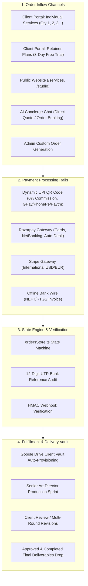
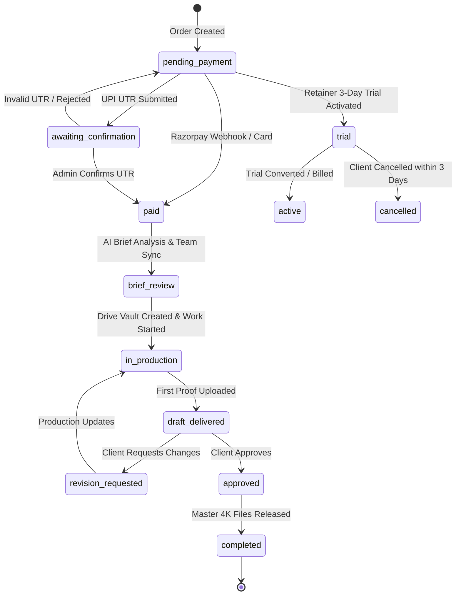

# SUTRA STUDIO — ORDER & PAYMENT SYSTEM ARCHITECTURE GUIDE
*The Complete End-to-End Technical & Operational Blueprint for Order Processing, Inflow Channels, Payment Gateways, and Fulfillment Workflows*

---

## 1. Executive Summary & Architecture Overview

The Sutra Studio Order & Payment Engine is an enterprise-grade, real-time commerce pipeline built with:
* **Frontend / Client Portal**: Next.js 16 App Router + Tailwind CSS + GSAP Fluid Micro-Interactions.
* **Database & Source of Truth**: Google Firebase Firestore (`orders`, `clients`, `quotes`, `notifications` collections).
* **Payment Processing**: Dual-rail architecture supporting **0% Commission Dynamic UPI QR (Direct T+0 Bank Settlement)** and **Razorpay / Stripe Gateway Integration** (Cards, NetBanking, Subscriptions).
* **Asset Storage & Delivery**: Automated Google Drive API Vault (`orders/{orderId}/briefs` and `orders/{orderId}/deliverables`).
* **Automation & Event Streaming**: Webhook routers, HMAC SHA-256 validation, and n8n webhook notification pipelines (WhatsApp, Slack, In-App Notifications).



---

## 2. Order Inflow Channels (કઈ કઈ રીતે Orders આવશે)

Sutra Studio receives and registers orders through **5 distinct entry channels**:

### Channel 1: Client Portal — Individual Disciplines (Quantity Multipliers)
* **Location**: Client Dashboard (`/orders` -> *Individual Services* tab).
* **How it Works**:
  1. Client selects any of the **12 core disciplines** (Image Creation, Video Creation, 3D Modeling, 360 Virtual Tour, Interior Design, Meta Ads Launcher, Web Development, etc.).
  2. Client sets the **Quantity Counter (1, 2, 3...)**:
     * **Qty = 1**: 1 Complete Production Package (e.g., Image Creation = 3–5 multi-angle 4K renders for 1 product).
     * **Qty = 2, 3+**: Linearly multiplies deliverables and volume with live dynamic subtotal calculation (`Base Price × Quantity`).
  3. Client fills the contextual brief form (Project goals, visual references, aspect ratios, style preferences).
  4. System generates a Firestore Order record with status `pending_payment`.

### Channel 2: Client Portal — Monthly Retainer Plans (With 3-Day Free Trial)
* **Location**: Client Dashboard (`/orders` -> *Retainer Plans* tab).
* **Available Tiers**:
  * **Starter Creative (₹5,999/mo)**: 5x 4K Renders, 1x Video Ad Reel, 48h SLA.
  * **Studio Growth (₹12,999/mo)**: 15x 4K Renders, 3x Video Ads, 3x 3D Models, 1x 360 Tour, Priority SLA.
  * **Bespoke Enterprise (₹19,999/mo)**: 25x 4K Renders, 6x Cinematic Videos, Full Web App, Dedicated Art Director.
* **Billing Cycle Options**: Monthly, Quarterly (10% Off), Annual (20% Off).
* **Trial Protection**: Automatically stages a **3-Day Risk-Free Trial** where ₹0 is charged upfront.

### Channel 3: Public Website Direct Checkout
* **Location**: Public Showcase pages (`/services`, `/studio`, `/pricing`, `/home`).
* **How it Works**:
  * Public visitors click **"Book Discipline"** or **"Start Retainer"**.
  * Guest users are seamlessly authenticated or prompted for quick email verification.
  * Cart state is preserved through localStorage and transferred directly into the checkout modal upon login.

### Channel 4: AI Concierge & Chat Assistant Booking
* **Location**: Floating AI Studio Assistant (`FloatingChatModal.tsx` & `chatTools.ts`).
* **How it Works**:
  * Clients discuss their requirements naturally in English, Hindi, or Gujarati with the AI Assistant.
  * The AI tool `create_quote` or `create_order` dynamically analyzes requirements, recommends optimal packages, calculates pricing, and generates an actionable checkout link directly in the chat window.

### Channel 5: Admin Custom Order Generation
* **Location**: Admin Portal (`/admin/orders` -> *Create Custom Order*).
* **How it Works**:
  * Sutra Studio administrators can create tailored project scopes, custom pricing, enterprise milestones, and bespoke deliverable packages.
  * System immediately notifies the client via email and in-portal alert with a direct payment link.

---

## 3. Payment Processing Channels (કઈ કઈ રીતે Payment આવશે)

Sutra Studio provides a resilient multi-gateway payment infrastructure:

```
+-----------------------------------------------------------------------------------------------+
|                                  PAYMENT METHOD BREAKDOWN                                     |
+--------------------------+-----------------------+---------------------+----------------------+
| Payment Mode             | Commission / Fees     | Settlement Speed    | Verification Mode    |
+--------------------------+-----------------------+---------------------+----------------------+
| 1. Dynamic UPI QR        | 0% (Zero Fees)        | Instant (T+0)       | 12-Digit UTR Audit   |
| 2. Razorpay Gateway      | 2% + GST              | T+1 to T+2 Days     | Instant Webhook HMAC |
| 3. Stripe (USD/EUR)      | 3% + Conversion Fee   | T+2 to T+5 Days     | Stripe Webhook Event |
| 4. Bank Wire (NEFT/RTGS) | 0% (Bank Charges Only)| Same Day / Next Day | Admin Manual Match   |
| 5. 3-Day Retainer Trial  | Pre-authorization     | 3 Days Deferred     | Automated Token Card |
+--------------------------+-----------------------+---------------------+----------------------+
```

### Method 1: Dynamic UPI QR Code (Primary — 0% Commission)
* **Target Apps**: Google Pay, PhonePe, Paytm, BHIM, CRED, Navi, and all BHIM UPI apps.
* **Mechanism**:
  1. System generates an RFC-compliant UPI deep-link URI:
     ```text
     upi://pay?pa=yashj9428-1@oksbi&pn=SUTRA%20STUDIO&am=5499.00&cu=INR&tn=Commission-ORD-8821
     ```
  2. Dynamically renders a clean QR code on screen and enables 1-tap deep linking on mobile devices.
  3. **Direct Settlement**: Funds land directly into the studio's bank account with zero intermediate aggregator deductions.
  4. **UTR Submission**: The client enters their **12-digit Bank Reference / UTR Number** from their payment receipt.
  5. **Security Gate**: Status transitions to `awaiting_confirmation`. Work is safeguarded until the Admin confirms settlement in `/admin/orders`.

### Method 2: Razorpay Payment Gateway
* **Target**: Credit Cards (Visa, Mastercard, RuPay, Amex), Debit Cards, NetBanking (50+ Banks), EMI, and UPI Autopay.
* **Mechanism**:
  1. System calls `POST /api/payments/create` to register a Razorpay Order ID.
  2. Client completes payment through Razorpay standard checkout popup.
  3. Razorpay sends an encrypted webhook to `POST /api/payments/webhook`.
  4. Webhook validates `x-razorpay-signature` using HMAC SHA-256 with `RAZORPAY_WEBHOOK_SECRET`.
  5. Order status immediately upgrades from `pending_payment` to `paid`.

### Method 3: Stripe Gateway (International Clients)
* **Target**: Global clients in US, UK, UAE, Europe paying in USD ($), EUR (€), GBP (£).
* **Mechanism**:
  1. Multi-currency converter computes the equivalent foreign currency exchange rate.
  2. Stripe PaymentIntent securely collects payment via 3D Secure 2 authentication.
  3. Automated tax calculation and international invoice generation.

### Method 4: Offline Bank Transfer / Corporate Invoice (NEFT / RTGS / IMPS)
* **Target**: Corporate clients, B2B agencies, and enterprise accounts requiring formal purchase orders (PO).
* **Mechanism**:
  1. System generates a downloadable GST-compliant Tax Invoice PDF with Sutra Studio's IFSC, Account Number, and Swift code.
  2. Client uploads bank transaction confirmation receipt.
  3. Admin verifies funds in the corporate bank account and marks the invoice as settled.

---

## 4. Order Lifecycle & Status Engine (કેવી રીતે System ચાલશે)

The order lifecycle is governed by a strict state machine implemented in `ordersStore.ts`:



### Complete Status Dictionary:

| Status Code | Client Portal Label | Operational Meaning |
| :--- | :--- | :--- |
| `pending_payment` | Payment Required | Order registered; awaiting gateway capture or UPI transfer. |
| `awaiting_confirmation` | Verifying Payment | UPI UTR submitted by client; queued for admin bank ledger verification. |
| `paid` | Payment Received | Payment confirmed 100%; queued for creative brief onboarding. |
| `trial` | 3-Day Free Trial | Active retainer trial; initial onboarding sprint initiated. |
| `brief_review` | Reviewing Brief | Creative director reviewing references, aspect ratios & specifications. |
| `in_production` | In Production | Active rendering / modeling / video production underway in studio. |
| `draft_delivered` | Review Deliverables | High-resolution drafts uploaded to client vault for feedback. |
| `revision_requested` | Revision in Progress | Studio implementing client modifications (Round 1 or Round 2). |
| `approved` | Client Approved | Client accepted deliverables; final export packaging initiated. |
| `completed` | Fulfilled & Closed | All 4K master files, source assets, and commercial licenses delivered. |
| `on_hold` | On Hold | Paused due to pending client clarification or missing assets. |
| `cancelled` / `refunded` | Cancelled / Refunded | Order terminated with refund ledger audit entry. |

---

## 5. Fulfillment & Digital Asset Vault Pipeline

```
+-----------------------------------------------------------------------------------------------+
|                            AUTOMATED DRIVE VAULT ARCHITECTURE                                 |
+-----------------------------------------------------------------------------------------------+
|  SutraStudio_Vault/                                                                           |
|  └── Clients/                                                                                 |
|      └── {clientId}_{ClientName}/                                                             |
|          └── Orders/                                                                          |
|              └── {orderId}_{ServiceSlug}/                                                     |
|                  ├── 01_Brief_And_References/  <-- Client-uploaded images, logos, CAD files    |
|                  ├── 02_WIP_Drafts/            <-- Watermarked preview passes for approval    |
|                  └── 03_Master_Deliverables/   <-- Final 4K UHD renders, ProRes video, GLB    |
+-----------------------------------------------------------------------------------------------+
```

1. **Automatic Vault Provisioning**: Upon status changing to `paid` or `in_production`, the system calls `googleDriveService.ts` to provision dedicated, encrypted client folders.
2. **Turnaround SLAs**:
   * **24–48 Hours**: Image Creation, Window & Facades, Meta Ads Creative.
   * **48–72 Hours**: Video Ads, 3D Modeling, Interior Design, AI Automation.
   * **3–7 Days**: 360 Virtual Tour, Digital Marketing Matrix, Website Development.
   * **7–14 Days**: SaaS Web Apps & Mobile Applications.
3. **Master Deliverables Packaging**:
   * Imagery: 3840×2160 (4K UHD) PNGs + Alpha transparent PNG passes.
   * Cinematic Video: 4K ProRes 422 HQ / MP4 in dual ratios (9:16 Vertical Reel + 16:9 Landscape).
   * 3D Assets: WebGL GLB/GLTF + iOS AR USDZ + Blender source `.blend` files.
   * Virtual Tours: Embeddable HTML5 interactive viewer code + 8K HDR equirectangular panoramas.

---

## 6. Automation, Notifications & Real-Time Sync

* **Webhook Ingestion (`/api/payments/webhook`)**:
  * Idempotency check prevents duplicate order processing.
  * Firestore update executed in under 200ms.
* **Notification Engine (`notificationsStore.ts`)**:
  * Real-time notifications dispatched to the client portal top navigation bell (`NotificationBell.tsx`).
  * Instant toast alert popup notifying the client upon status progression or deliverable upload.
* **n8n Automation Webhooks (`/api/n8n/webhook`)**:
  * Triggers external automated channels (WhatsApp client updates, Slack team dispatch, Google Drive sync).

---

## 7. Admin Governance & Management Controls

The Admin Portal (`/admin` and `/admin/integrations`) provides complete operational oversight:
1. **Live Orders Ledger**: Filter by status (`pending_payment`, `in_production`, `draft_delivered`, etc.).
2. **UTR Verification Deck**: 1-click verify or reject UPI reference numbers with direct bank ledger audit notes.
3. **Deliverable Dispatcher**: Upload final files, Drive links, and release download licenses to client accounts.
4. **Refund & Cancel Management**: Automated gateway refund requests (`/api/payments/refund`) with audit trail logging.

---

*Document Version: 1.0 • Last Updated: October 2026 • Sutra Studio Engineering & Operations*
